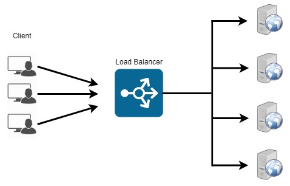

**Load Balancer**  
Jun, 2019  
Load-balanced supervised servers for calculating client's functions.    

In this example, I implemented a simple load balancer with 3 supervised servers.  For simplicity, the servers will run on a shared Node. 
Each server receives a function from the load balancer, runs it and sends the result to client's PID. Each server can also run multiple functions from multiple clients simultaneously.  
I used Erlang's gen_server and supervisor modules to implement the servers.

**System's API:**  
  &nbsp;&nbsp;&nbsp;- startServers:  
  &nbsp;&nbsp;&nbsp;&nbsp;&nbsp;&nbsp;Starts and registers 3 servers and a supervisor.  
  &nbsp;&nbsp;&nbsp;- stopServers:  
  &nbsp;&nbsp;&nbsp;&nbsp;&nbsp;&nbsp;Stops the servers and the supervisor.  
  &nbsp;&nbsp;&nbsp;- calcOnServer:  
  &nbsp;&nbsp;&nbsp;&nbsp;&nbsp;&nbsp;Runs a given function on one of the servers.  
  &nbsp;&nbsp;&nbsp;- numberOfRunningFunctions:  
  &nbsp;&nbsp;&nbsp;&nbsp;&nbsp;&nbsp;Returns the number of running functions on server number <Server_num>.  
  
  
**Restart strategy:**  
&nbsp;&nbsp;&nbsp;one_for_one: If a server crashes or a client's function caused it to crash, only that server is restarted.  

For more info and an example, please view [this](example+explanation.txt) file.
